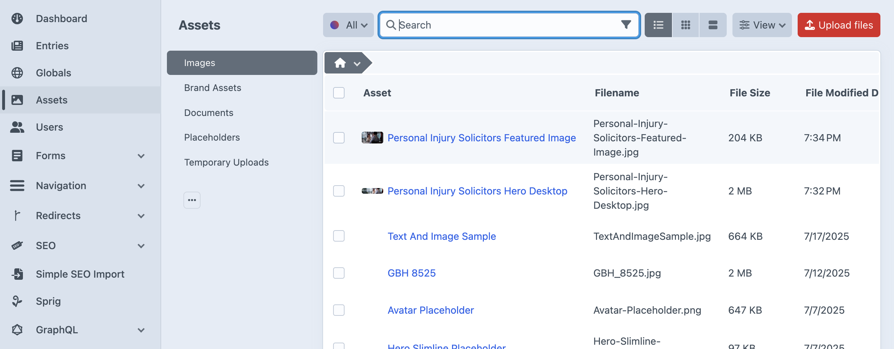

# The Images Volume

The **Images** volume is where you will manage the vast majority of your site's visual content. It holds all the general-purpose images that you use in content blocks, page heroes, blog posts, and more. Think of it as your primary photo library for day-to-day content editing.

## Managing Images

When you select the `Images` volume, you'll see a list or grid of all the images that have been uploaded. From here, you can upload new files, search for existing ones, or click on an image to edit its details.

### Uploading a New Image

1.  Make sure you have the `Images` volume selected in the left sidebar.
2.  Click the red **Upload files** button in the top-right corner.
3.  Select one or more image files from your computer to upload.

### Editing Image Details

Once an image is uploaded, you can—and should—edit its details to improve accessibility and content management. Clicking on any asset will open the editor.

There are two crucial fields to pay attention to:

-   **Title**: This is a user-friendly name for the image that helps you identify it within Craft CMS. For example, instead of the filename `DSC_0123.jpg`, you could title it "Team photo from company retreat". This title is for internal use and makes finding assets much easier.
-   **Alternative Text (Alt Text)**: This is a short, descriptive sentence that explains the content and function of the image. Alt text is essential for accessibility, as it is read aloud by screen readers for visually impaired users. It is also important for SEO, as it helps search engines understand the image's context. A good alt text for a picture of a golden retriever might be: "A golden retriever fetching a red ball in a sunny park."

After editing, click the **Save** button to apply your changes.

---

*Keeping your `Images` volume organized with clear titles and descriptive alt text is key to maintaining a professional and accessible website.*