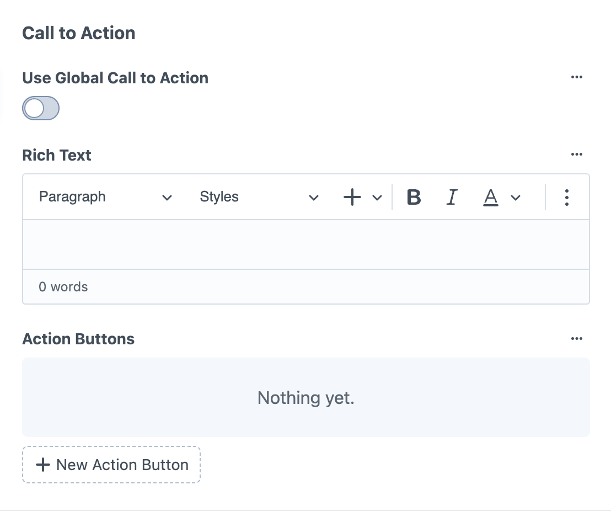

# Call to Action

*Conversion-focused sections with buttons and promotional content*

The Call to Action block creates prominent sections designed to encourage visitor action. It offers both global and local content options, allowing you to use consistent site-wide messaging or create page-specific calls-to-action.

## Global vs Local Content

### Global Call to Action

<small>Call to Action block with Use Global Call to Action toggle enabled, showing blue info...</small>

**Use Global Call to Action toggle** – When enabled, uses centrally managed content
- Content is managed in Globals → Global Content → Call to Action
- Same call-to-action appears consistently across multiple pages
- Edit once, updates everywhere the global CTA is used
- Useful for site-wide campaigns or standard conversion messaging

### Local Call to Action

<small>Call to Action block with "Use Global Call to Action" toggle disabled, showing Rich Text...</small>

**Use Global Call to Action toggle disabled** – Create page-specific content

**Rich Text field** – Custom content for this specific call-to-action
- Paragraph and heading styles
- Text formatting options
- Full rich text editing capabilities

**Action Buttons** – Custom buttons for this CTA
- "New Action Button" option to add multiple buttons
- Custom button text and link destinations

**Color controls:**
- **Heading Colour** – Color for CTA headings
- **Text Colour** – Color for body text
- **Background Colour** – Background color for the entire CTA section
- **Background Image** – Optional background image with upload, search, and file options

## When to Use Each Option

**Use Global CTAs for:**
- Consistent site-wide messaging (e.g., "Contact us today")
- Standard service offerings or promotions
- Company-wide campaigns
- Calls-to-action that appear across multiple pages

**Use Local CTAs for:**
- Page-specific offers or messaging
- Service-specific calls-to-action
- Unique campaigns targeted to specific audiences
- Custom background images relevant to specific content

## Usage

Call to Action blocks work well:
- **At the end of content** – Encourage action after visitors read your information
- **Between content sections** – Break up long pages with conversion opportunities
- **On service pages** – Drive inquiries for specific offerings
- **On landing pages** – Focus visitor attention on key actions

---

*Call to Action blocks provide flexible conversion elements with both global consistency and local customization options.*