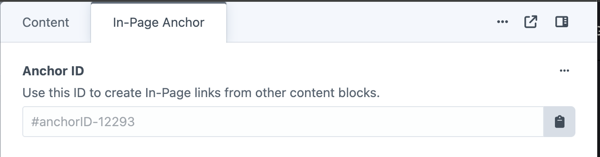

# Content Blocks

*Flexible content components for building pages*

Content blocks are modular components used to build pages in the Content tab of entries. Instead of a single text editor, you combine different block types to create flexible page layouts. Each block handles specific content types with their own fields and design options.

## What You'll Learn

-   What Content Blocks are and how they create flexible page layouts.
-   The common features shared across most blocks, such as color controls and action buttons.
-   The difference between "Global" and "Local" content options.

## In This Section

-   **[Blog Listing](blog-listing.md)**: Automatically display a list of your latest blog posts.
-   **[Call to Action](call-to-action.md)**: Create prominent buttons and links to guide user actions.
-   **[Contact Form](contact-form.md)**: Add inquiry forms to your pages.
-   **[Contact & Location](contact-location.md)**: Display business contact information with an embedded map.
-   **[Entry Cards](entry-cards.md)**: Feature links to other site content in a visual card format.
-   **[FAQ](faq.md)**: Create expandable question-and-answer sections.
-   **[Tabbed Navigator](tabbed-navigator.md)**: Organize content into an interactive tabbed interface.
-   **[Testimonials](testimonials.md)**: Showcase customer reviews in a carousel.
-   **[Text & Image](text-image.md)**: Combine rich text with images in flexible layouts.
-   **[Text](text.md)**: A simple, flexible block for any formatted text content.
-   **[USPs](usps.md)**: Highlight your unique selling points with icons and text.
-   **[Video](video.md)**: Embed videos from YouTube or Vimeo.

## Adding Content Blocks

Content blocks are added in the Content tab when editing entries.

**To add blocks:**
1. Open any entry for editing
2. Go to the Content tab
3. Scroll to bottom and click "Add Content Block"
4. Select the block type from the dropdown

## Common Block Features

Most content blocks share these standard features:

### Rich Text Fields

Many blocks include rich text editors for content creation.

**Rich text features:**
- Paragraph styles and heading levels
- Bold, italic, and link formatting
- Bulleted and numbered lists
- Word count tracking

### Action Buttons

Add calls-to-action to encourage visitor engagement.

**Button functionality:**
- Custom button text
- Link destinations (internal pages, external URLs, email addresses)
- Multiple buttons per block

### Action Button Types

#### Entry

Link to other pages, blog posts, or any content entry on your site. The Entry type provides a dropdown to search and select from existing entries, making it easy to create internal navigation.

**Features:**
- Choose any entry from your site
- Custom link text (e.g., "Read more", "Learn more")
- Option to open in new window
- Automatic URL generation

#### In-Page Link

Create smooth-scrolling navigation to specific sections within the current page. Use anchor IDs to jump to different content blocks or headings on the same page.

Every Content Block has an Anchor ID, available on its In-Page Anchor tab.  

**Features:**
- Target any anchor ID on the page (e.g., #anchorID-10014)
- Custom link text for the button
- Smooth scroll animation when enabled
- Perfect for long-form content and table of contents navigation

#### Call Now

Create clickable telephone links that allow visitors to call your business directly from their mobile device. Choose between using your site's global phone number or entering a custom number for specific purposes.

**Features:**
- **Global Telephone Number**: Uses telephone number from Globals > Company Info
- **Custom Telephone Number**: Enter specific tel: link (e.g., tel:01234567890)
- Custom display text for the phone number
- Automatically creates clickable tel: links for mobile devices
- Perfect for contact pages and service inquiries

### Color Controls

Customize block appearance with predefined colors.

**Color options:**
- **Heading Colour** – Color for block titles
- **Text Colour** – Color for body text
- **Background Colour** – Block background including transparent

**Available colors include brand colors, neutral options, and transparent backgrounds.**

### Global Content Options

Many blocks offer global vs local content choices.

**Global content:**
- Content managed centrally in Global Settings
- Updates appear across all pages using the global content
- Useful for consistent messaging like testimonials, USPs, and contact forms

**Local content:**
- Content specific to the current page
- Customized for particular audiences or purposes

### Entry Relationships

Some blocks can reference other site content.

**Relationship features:**
- Link to other pages, blog posts, or team members
- Search and select from existing entries
- Automatic updates when referenced content changes
- Status indicators show live vs draft content

---

*Content blocks provide flexible page building without requiring technical knowledge. Each block type has specific fields and options detailed in their individual documentation pages.*