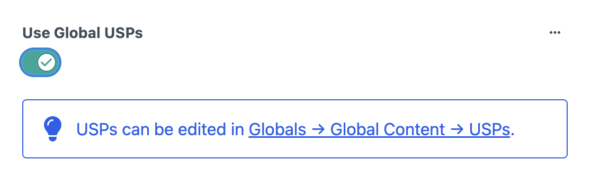
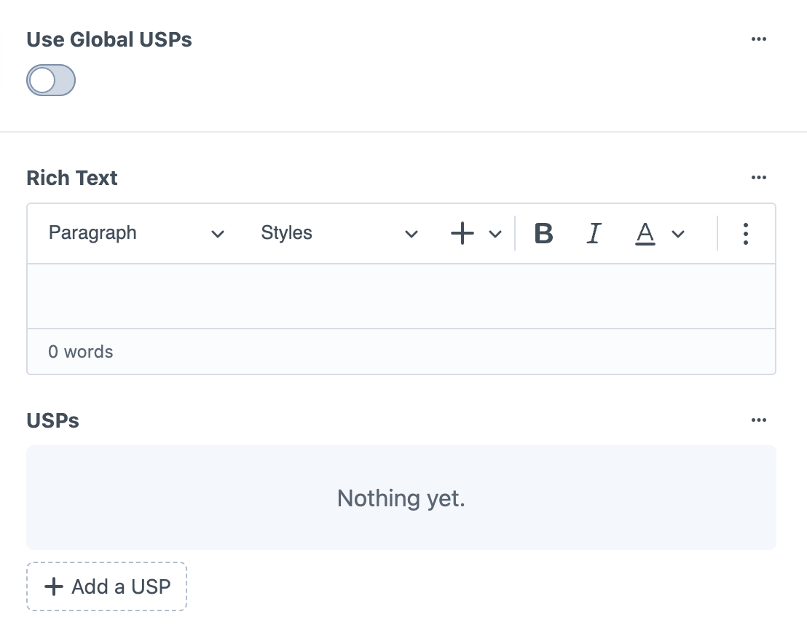
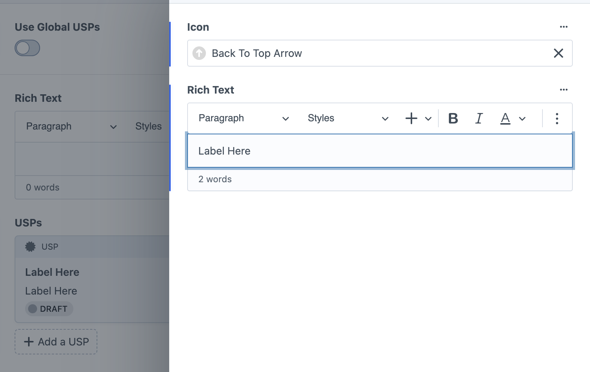

# USPs (Unique Selling Points)

*Highlight key features and benefits with icons*

The USPs block displays key selling points or benefits with icons and optional text. It offers both global and local options, allowing you to use consistent site-wide USPs or create page-specific unique selling points.

## Global vs Local Content

### Global USPs

<small>USPs block with Use Global USPs toggle enabled</small>

**Use Global USPs toggle** – When enabled, uses centrally managed USP content
- Content is managed in Globals → Global Content → USPs
- Same USPs appear consistently across multiple pages
- Edit once, updates everywhere the global USPs are used
- Useful for standard company benefits that apply site-wide

### Local USPs

<small>USPs block with Use Global USPs toggle disabled, showing Rich Text field, USPs section with...</small>

**Use Global USPs toggle disabled** – Create page-specific USP content

**Rich Text field** – Optional introductory content above the USPs
- Paragraph and heading styles
- Text formatting options
- Full rich text editing capabilities
- Word count display

**USPs section** – Required USP items (marked with red asterisk)
- "Add a USP" button to create individual selling points
- Each USP contains an icon and optional text content
- Displays in a responsive grid layout

## Adding USP Items

When adding a USP item, you configure:

**Icon field** – Required visual element for the USP
- Upload SVG icons or select from existing assets
- Icons display inline with the text content
- Consistent sizing across all USP items

**Rich Text field** – Optional descriptive text for the USP
- Brief descriptions or benefit explanations
- Full rich text editing capabilities
- Paragraph and text formatting options
- Word count display

**Color Controls:**
- **Heading Colour** – Color for USP headings and titles
- **Text Colour** – Color for USP text and descriptions  
- **Background Colour** – Background color for the entire USPs section

**Available colors include brand colors, neutral options, and transparent backgrounds.**

## When to Use Each Option

**Use Global USPs for:**
- Standard company benefits that apply across multiple pages
- Core value propositions used throughout the site
- Consistent messaging about services or products
- Key differentiators that should remain centralized

**Use Local USPs for:**
- Service-specific benefits relevant to particular pages
- Product-focused selling points
- Page-specific advantages or features
- Custom USPs that don't apply site-wide

## Usage

USPs blocks work well:
- **On service pages** – Highlight specific benefits of individual services
- **Homepage sections** – Showcase key company advantages
- **Product pages** – Display product features and benefits
- **About pages** – Communicate company values and differentiators
- **Landing pages** – Emphasize conversion-focused benefits

The icon and text combination makes USPs visually appealing and easy to scan, helping visitors quickly understand key benefits.

---

*USPs blocks provide an effective way to communicate key benefits and selling points with visual icons and flexible global or local content management.*