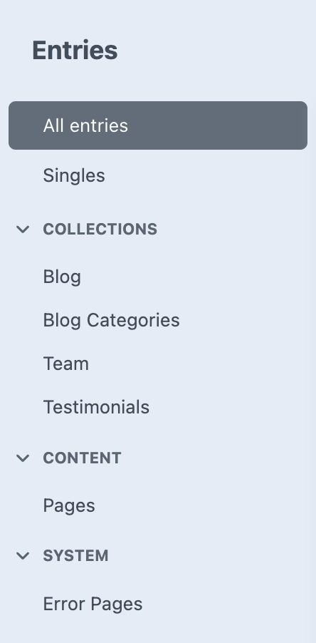
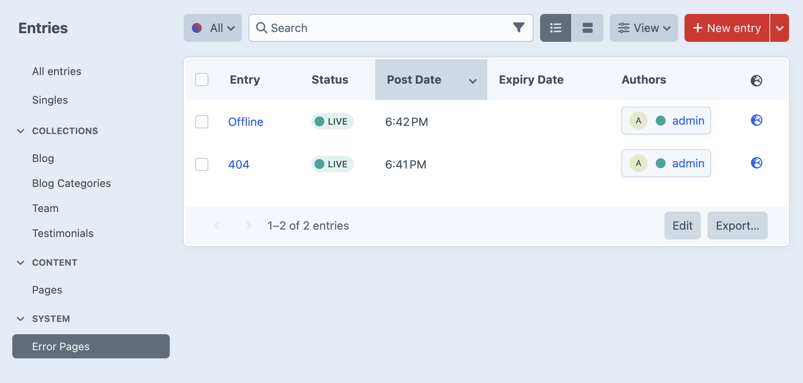

# Content Types

*How content is structured in your CMS*

Craft CMS organizes content using Entries, but unlike traditional systems where everything is a "post" or a "page", entries in Craft are grouped by purpose. This structure makes it easier to manage content consistently and understand where everything belongs.

### Entry Organization
- Singles
  - Homepage
- Company section
  - Blog posts 
  - Blog categories
  - Team member profiles
  - Customer testimonials
- Content section
  - Main site pages (About, Services, Contact)
  - Landing pages
- System section
  - Error pages (404, 503)
  - Maintenance pages

In the Control Panel, the Entries section in the sidebar is grouped into four main categories:

## Entry Categories

### Singles

These are unique, standalone pages that only appear once on the site.

- **Homepage** – Your main landing page  
  Includes hero sections, featured content, calls to action, and other homepage-specific blocks.  
  Often the most visited and curated page on the site.

### Collections

These are content types made up of multiple entries that are usually displayed in lists or groups across the site.

- **Blog** – Articles, news, or updates  
  Posts are dated and can be tagged or categorized.  
  They appear automatically in blog listings and are SEO-optimized.

- **Team Members** – Staff profiles  
  Includes photos, bios, job titles, and social links.  
  Useful for About pages and contact sections, often enhanced with structured data.

- **Testimonials** – Customer reviews  
  Short quotes, star ratings, and customer details.  
  Typically used on sales pages to build credibility and trust.

### Content

These are the main pages of your website—the ones visitors are likely to navigate to directly.

- **About** – Company overview and mission
- **Services** – What you offer
- **Contact** – Phone numbers, forms, locations
- **Landing Pages** – Campaign-specific or promotional pages
- **Policy Pages** – Legal content like privacy policy and terms of service

These pages form the backbone of your site and are typically included in the main navigation.

### System

Supporting content that helps the site function properly.

- **Blog Categories** – Used to organize blog content  
  Helps visitors find related posts and improves SEO.

- **Error Pages** – Shown when something goes wrong  
  Includes custom 404 and 503 pages with branded messages.

## Content Relationships

### How Different Types Work Together

Content types are designed to complement each other across the site.

**Blog posts connect to categories** for better organization and navigation. Visitors can filter posts by topic, and search engines better understand your content structure.

**Team members appear in multiple places** once created. Add someone to the Collections section and they can appear on the About page, contact forms, and service pages without duplicating information.

**Testimonials work everywhere** to build trust. Create them once in Collections and display them on the homepage, service pages, or dedicated review sections.

### Benefits of This Structure

**Consistency** – Update information in one place and it changes everywhere it appears.

**Efficiency** – No need to copy and paste the same content across multiple pages.

**Accuracy** – Single source of truth prevents conflicting information.

## Comparing to WordPress

WordPress users will recognize some concepts but find Craft's approach more structured.

**WordPress approach:**
- Posts for time-sensitive content
- Pages for static content

**Craft approach:**
- Everything is an Entry, organized by purpose
- Collections for repeatable content (like WordPress Posts, but more flexible)
- Content for main pages (like WordPress Pages, but with better structure)
- System for administrative content

**Key advantages:**
- Better organization makes content easier to find
- Purpose-driven categories clarify what you're editing
- Specialized fields for each content type
- Less time spent searching for content

## Working with Content Types

### Finding and Managing Content

**Navigate to content:**
1. Click Entries in the sidebar
2. Choose your category (Singles, Collections, Content, System)
3. Select the specific content type
4. Browse the list of entries

**Create new entries:**
Each content type has a "New Entry" button that opens a form customized for that type of content.

**Entry features:**
- **Custom fields** specific to each content type
- **Status options** (Draft, Published, Scheduled)
- **Search and filtering** to find content quickly
- **Bulk actions** for managing multiple entries

## Best Practices

### Organization Tips

**Use categories as intended** – Keep blog content in Collections, main pages in Content, and administrative items in System.

**Stay consistent** – Put all team members in Collections → Team, all testimonials in Collections → Testimonials.

**Think about reuse** – If content might appear in multiple places, it probably belongs in Collections.

### Content Workflow

1. **Plan the content type** before creating
2. **Choose the right category** based on how the content will be used
3. **Fill out all relevant fields** to get the most from structured content
4. **Save as draft** while working
5. **Preview** before publishing
6. **Publish strategically** considering timing and related updates

## Getting Started

### Explore the Structure

1. **Click through each category** to see what content types exist
2. **Open existing entries** to understand the fields and structure
3. **Compare different content types** to see how they're specialized
4. **Try the search function** to get comfortable finding content

### Next Steps

Once you understand how content is organized:
- [Content Blocks](content-blocks.md) – Learn about flexible page building
- [Page Structure](page-structure.md) – Understand how individual pages work  
- [Publishing](/page-management/publishing) – Master the publishing workflow

---

*This organized approach to content makes managing a website much more intuitive. Spend some time exploring each content type to understand how they work together.*