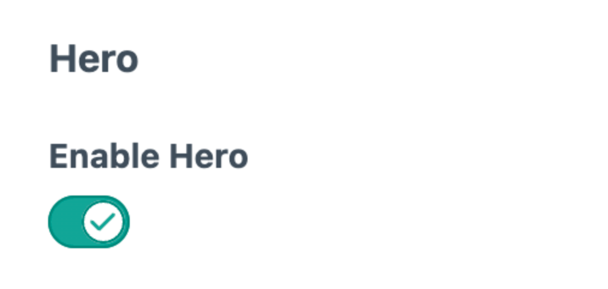
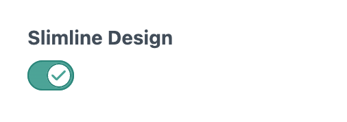
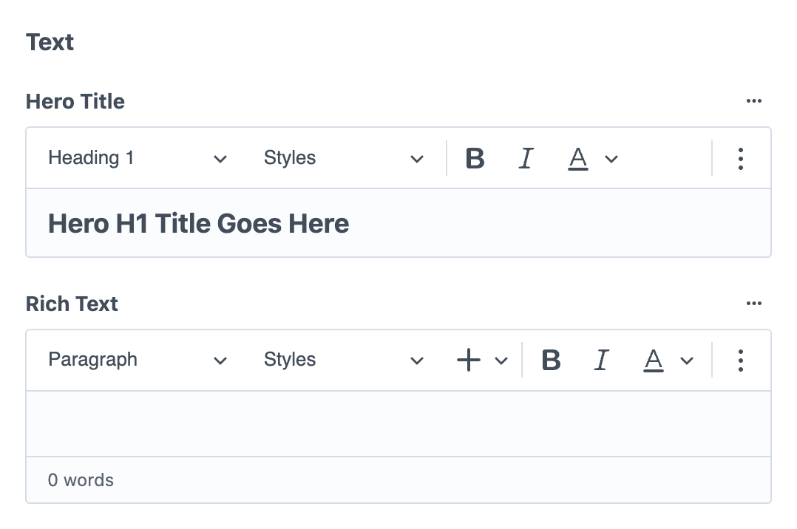
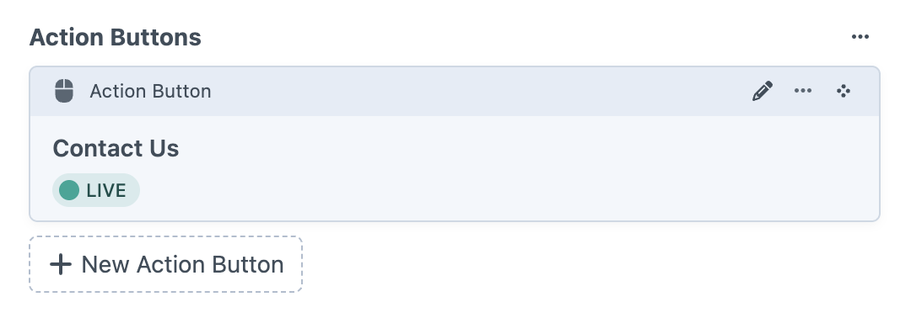

# Hero

*Page header sections with images, text, and call-to-action buttons*

## Hero vs Content Blocks

- Hero sections are separate from content blocks
- Located in the "Hero" tab when editing pages
- Limited to one hero per page
- Designed for page headers and main messaging

## Fields

### Enable Hero

**Enable Hero toggle** – Turn the hero section on or off for the page

**Slimline Design toggle** – Alternative design option (when available)

### Images

**Desktop Image** – Main background image for larger screens
- Add an image from existing assets or upload a new file
- Search existing images in the asset library

**Mobile Image** – Optional alternative image for mobile devices  
- Same upload and search options as desktop image
- Falls back to desktop image if not provided

**Image fallback system** – If no hero image is added, the system will check for an image in parent entries (if enabled), and finally fall back to the global placeholder image set in Globals → Global Content → Placeholders.

### Text

**Hero Title** – Main headline field with rich text formatting
- Heading styles (Heading 1, etc.)
- Text formatting options (bold, italic, alignment)
- Word processing-style toolbar

**Rich Text** – Supporting content area with full formatting options
- Paragraph and heading styles
- Bold, italic, and link formatting
- Lists, tables, and other rich text features
- Word count display
- Full toolbar with alignment, lists, links, and more

### Action Buttons

**Action Buttons** – Call-to-action buttons for the hero
- Add multiple buttons using "New Action Button"
- Custom button text and link destinations
- Support for internal pages, external URLs, or email addresses

## Usage

Use Hero sections for:
- **Landing pages** – Create strong first impressions with compelling visuals
- **Homepage headers** – Welcome visitors with key messaging
- **Service pages** – Highlight offerings with professional imagery
- **Campaign pages** – Drive specific actions with targeted content

The Enable Hero toggle lets you turn heroes on or off without losing the content, useful for testing different page layouts.

---

*Hero sections are managed in the Hero tab and provide prominent page introductions with images, headlines, and calls-to-action.*