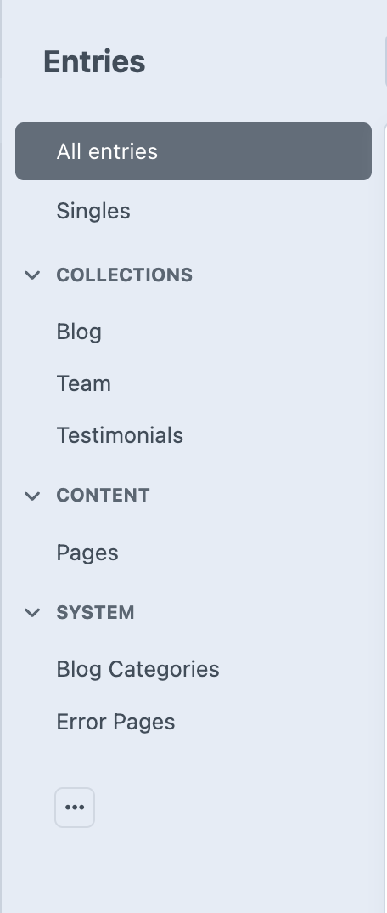
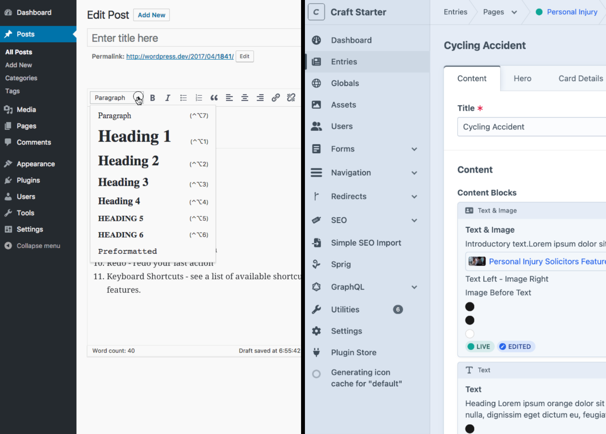

# Coming from WordPress

If you're familiar with WordPress, you'll find many concepts in Craft CMS are similar but enhanced. This guide will help you understand the key differences and similarities.

## Core Concepts

### Everything is an Entry

In WordPress, you have Posts and Pages. In Craft CMS, **everything is an Entry**, but entries are organized into different types:

- **Pages** (like WordPress Pages) - Static content pages
- **Blog Posts** (like WordPress Posts) - News, articles, blog content
- **Team Members** - Staff profiles and bios
- **Testimonials** - Customer reviews and feedback

### Entry Organization

Instead of WordPress's basic categorization, entries are organized into logical groups:

- **Singles**: Homepage
- **Collections**: Blog posts, team members, testimonials
- **Content**: Main website pages
- **System**: Blog categories, Technical pages like 404 errors

## Familiar Features

### Content Editing
- **Content Block Editor**: Flexible content editing, similar to WordPress block editor and Advanced Custom Fields
- **Assets**: Upload and manage images and documents, similar to WordPress Media Library
- **Publishing**: Draft, publish, and schedule Content

### Site Management
- **Navigation**: Manage navigation menus (like WordPress Menus)
- **Globals**: Site-wide settings (like WordPress Customizer)
- **Users**: Manage user accounts and permissions

## Key Differences

### More Flexible Content Structure
WordPress has a fixed structure for posts and pages. Craft CMS uses a **content block system** that lets you build custom page layouts:

- Mix text, images, videos, and forms on any page
- Reuse content blocks across different pages
- Create complex layouts without coding

### Global vs Local Content
Some content blocks support both Global and Local modes. Global content is edited once in the Globals section and reused across multiple entries. Alternatively, you can add custom local blocks directly to individual entries when unique content is needed.
- **Call to Action**
- **Contact Form**
- **FAQ**
- **USPs**

### Enhanced SEO
Built-in SEO tools that go beyond WordPress plugins:
- **Page-level SEO**: Custom meta titles and descriptions
- **Schema markup**: Structured data for search engines
- **Social media cards**: Twitter and Facebook previews

## WordPress to Craft CMS Mapping

| WordPress Feature | Craft CMS Equivalent |
|------------------|---------------------|
| Posts | Entries → Blog |
| Pages | Entries → Pages |
| Menus | Navigation |
| Customizer | Globals → Site Config |
| Widgets | Globals → Global Content |
| Media Library | Assets |
| Categories/Tags | Built into content types |

## Getting Comfortable

### Start with Familiar Tasks
1. **Edit a page** - Similar to WordPress page editing
2. **Add an image** - Upload and insert images
3. **Update navigation** - Modify your site menus
4. **Create a blog post** - Write and publish content

### Explore New Features
1. **Content blocks** - Build flexible page layouts
2. **Global content** - Manage site-wide elements
3. **Advanced SEO** - Optimize for search engines

## Common Questions

**Q: Where are my plugins?**
A: Craft CMS uses a different approach. Many features you'd use plugins for in WordPress are built-in or handled through the content block system.

**Q: How do I customize my theme?**
A: Visual customization is handled through Global Settings. Code changes require developer assistance.

**Q: Can I import from WordPress?**
A: Yes, but this requires technical setup. Contact your developer for assistance.

## What's Next?

Ready to explore? Continue with:
- [Control Panel Tour](control-panel-tour.md) - Learn the interface
- [Your First Edit](first-edit.md) - Start editing content
- [Content Blocks](/content-blocks/) - Discover flexible content options

---

*Remember: Many concepts are similar to WordPress, but Craft CMS offers more flexibility and power for content creators.*