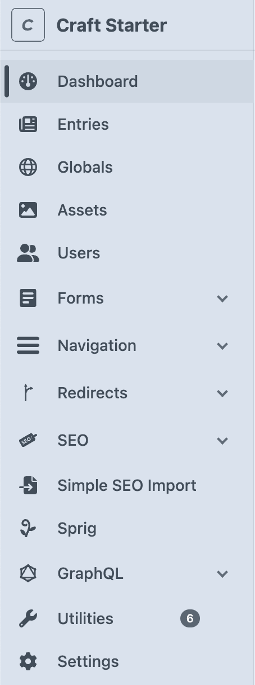
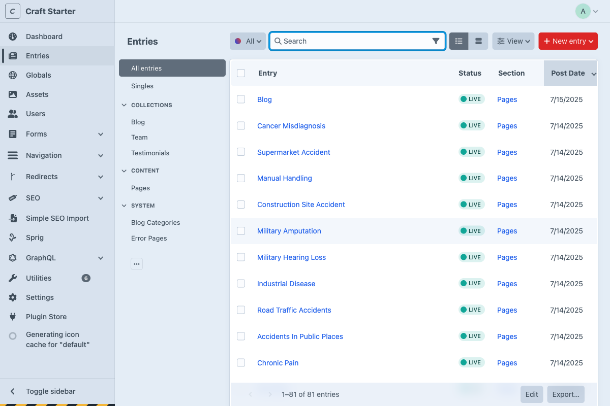
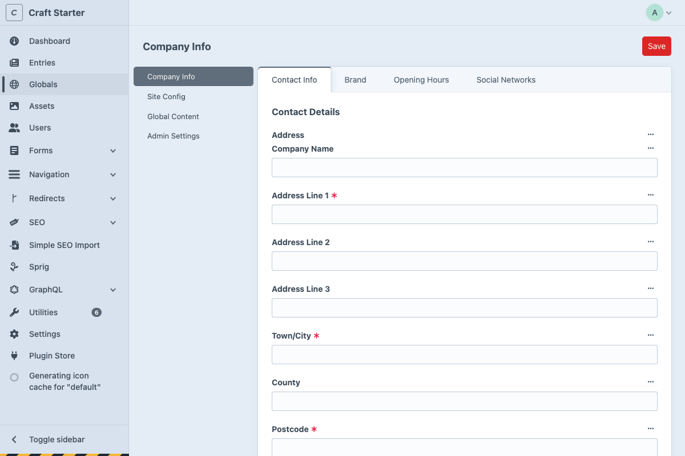
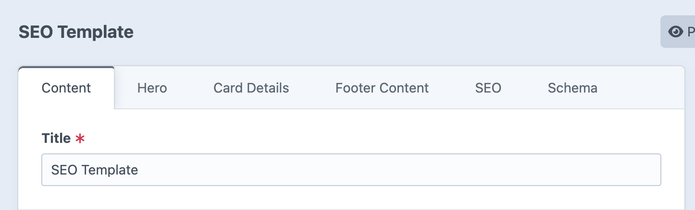
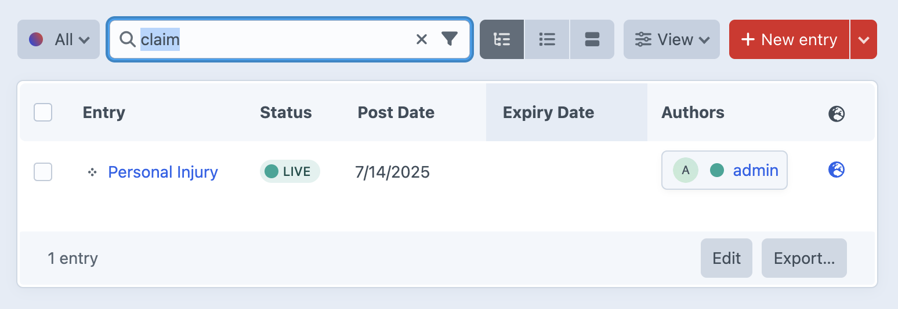
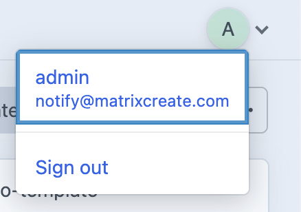
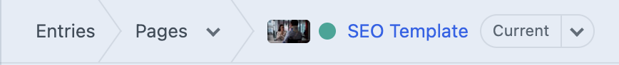

# Control Panel Tour

*Getting familiar with the Craft CMS interface and navigation*

The Control Panel is your workspace for managing all website content. Rather than diving deep into specific features, this tour shows you where everything is located and how the interface is organized.

## Main Navigation

The left sidebar contains your main navigation, organized into logical sections:

### Entries Section
This is where you'll spend most of your time managing content:

- **Singles**: Special one-off pages
  - Homepage

- **Collections**: Groups of content typically used in other sections of the site
  - Blog posts and articles
  - Team member profiles
  - Customer testimonials
  
- **Content**: Primary content pages
  - About, Services, Contact pages
  - All your site's main content

- **System**: Technical pages
  - Blog categories
  - 404 error pages
  - Maintenance pages

### Global Settings
Site-wide configuration accessible through three sections:

- **Company Info**: Business details, contact information, and brand assets
- **Site Config**: Technical site settings and configurations  
- **Global Content**: Reusable content elements used across multiple pages

## Working with Entries

### Entry List View
When you click on any content type, you'll see a list of entries:

- **Title**: The name of your page or post
- **Status**: Draft, Published, or Scheduled
- **Date**: When it was created or last modified
- **Actions**: Edit, duplicate, or delete entries

### Content Organization
Entries are organized by purpose and content type rather than generic categories, making it easier to find related content.

## Content Editing Interface

When you edit any entry, you'll see multiple tabs:

### Main Tabs:
- **Content**: Your main page content (content blocks)
- **Hero**: Page header section
- **Footer Content**: Page-specific footer elements
- **SEO**: Search engine optimization settings
- **Schema**: Structured data for search engines

## Quick Actions

### Search
Use the search bar to quickly find any content:

- Search by title, content, or author
- Filter by content type
- Find entries across all sections

### User Menu
In the top right corner, access your account settings:

- Account settings
- Change password
- Sign out

## Navigation Tips

### Breadcrumbs
Always know where you are in the system:

### Back Button
Your browser's back button works normally - use it to navigate between sections.

### Keyboard Shortcuts
- **Ctrl/Cmd + S**: Save your work
- **Ctrl/Cmd + Enter**: Save and continue editing

## Interface Organization

The Control Panel groups related functionality together rather than separating by content format. This organizational approach helps you find tools and content based on what you're trying to accomplish.

## Next Steps

Now that you understand the Control Panel layout:

1. **Explore the sections** - Click through Entries, Global Settings, and other areas
2. **Try the search** - Use it to find specific content quickly  
3. **Open an existing entry** - See how content editing works
4. **Ready to edit?** - Continue to [Your First Edit](first-edit.md)

For detailed information about specific areas, refer to:
- [Content Blocks](/content-blocks/) - Building pages with flexible content
- [Global Settings](/global-settings/) - Managing site-wide configuration  
- [Navigation](/navigation/) - Organizing site menus and structure

---

*Take your time exploring the interface. Everything is designed to be intuitive once you understand the organization.*