# Your First Edit

Let's walk through editing a page step-by-step. This tutorial will show you the basics of working with content in Craft CMS.

## Step 1: Choose a Page to Edit

We'll start by editing an existing page to understand the interface.

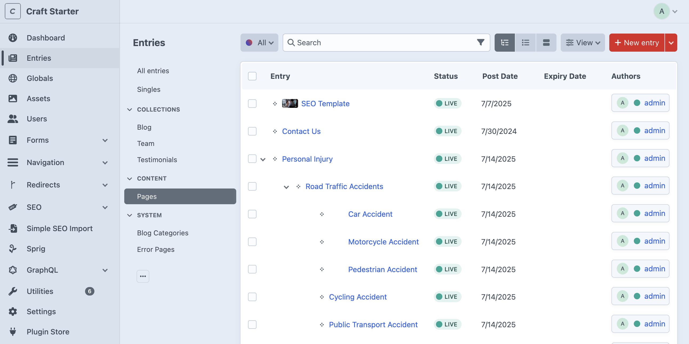

1. Click **Entries** in the left sidebar
2. Click **Content** to expand the section
3. Click **Pages** to see your site's main pages
4. Click on any page title to open it for editing

## Step 2: Understanding the Editing Interface

Once you open a page, you'll see several tabs at the top:

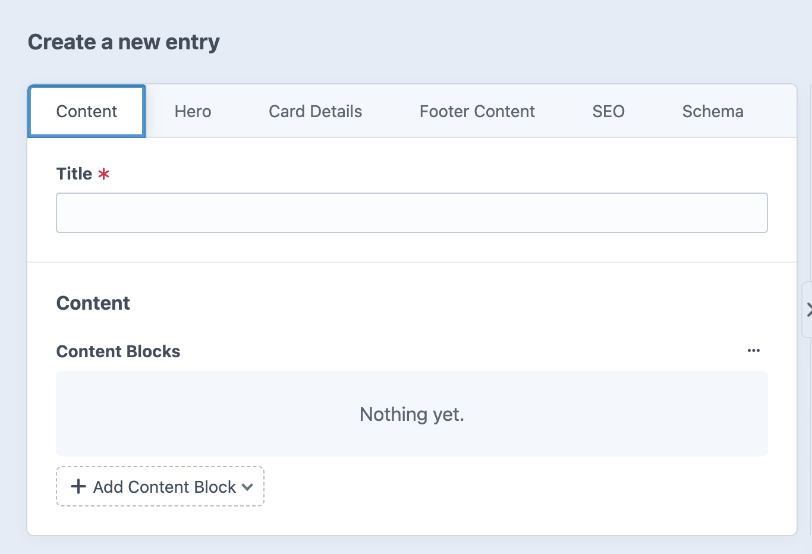

### The Content Tab
This is where you'll do most of your work. The **Content** tab contains your page's main content using our content block system.

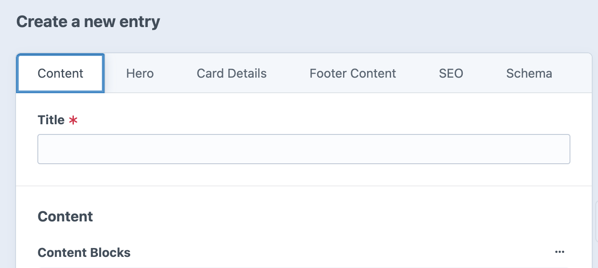

## Step 3: Working with Content Blocks

### What Are Content Blocks?
Instead of one large text editor, content is built using "blocks" - individual pieces of content that you can arrange and customize.

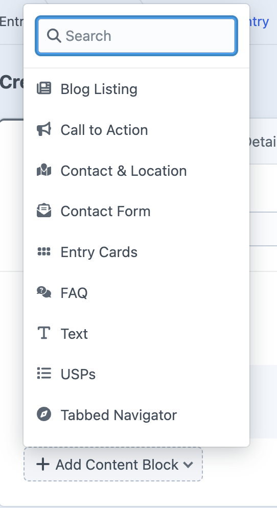

### Available Block Types:
- **Text**: Rich text content (headings, paragraphs, lists)
- **Text & Image**: Combine text with images
- **Call to Action**: Buttons and promotional sections
- **Contact Form**: Contact and inquiry forms
- **FAQ**: Question and answer sections
- **Video**: Embedded videos
- **And more...**

### Adding Your First Block

1. Click **+ Add Content Block** at the bottom
2. Choose **Text** from the list
3. A new text block will appear

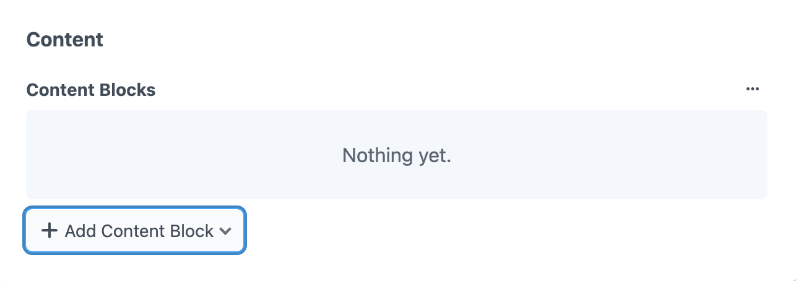

## Step 4: Editing Content

### Text Block Example
Let's edit a text block:

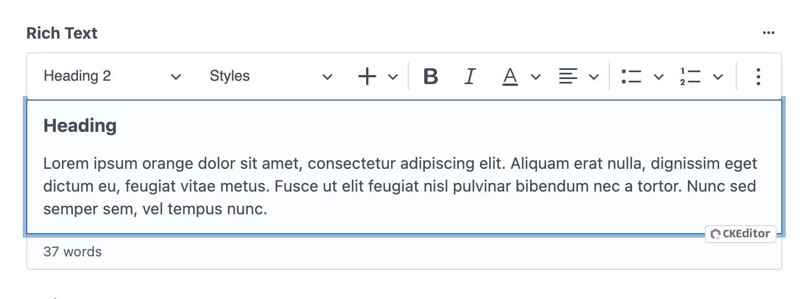

1. Click in the text area
2. Type or paste your content
3. Use the toolbar to format text (bold, italic, lists, etc.)
4. Add links by selecting text and clicking the link button

### Adding Images
To add an image to your text:

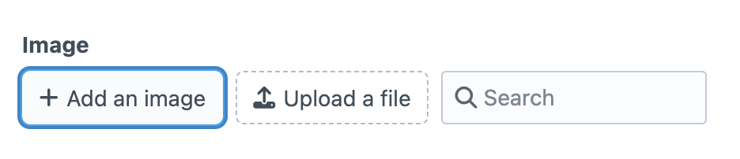

1. Click the image icon in the text editor
2. Choose **Add an image** to upload a new file
3. Or choose **Search** to find existing images
4. Select your image and click **Insert**

### Color Controls
Many blocks have color options:

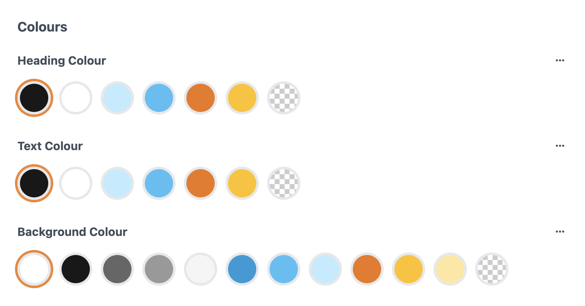

- **Heading Colour**: Changes the color of headings in this block
- **Text Colour**: Changes the color of body text
- **Background Colour**: Changes the block's background color

## Step 5: Saving Your Work

### Save Options
At the top right of the page:

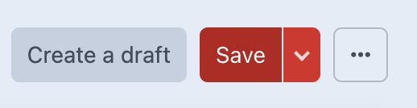

- **Save**: Saves your changes as a draft
- **Save and continue editing**: Saves and stays on the page
- **Save and add another**: Saves and creates a new entry

### Publishing
Your changes won't appear on the live site until you publish:

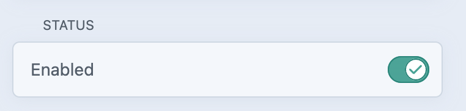

1. Set the status to **Live** to publish
2. Or keep as **Disabled** to save as a draft
3. You can schedule publication for later

## Step 6: Preview Your Changes

Before publishing, preview your changes:

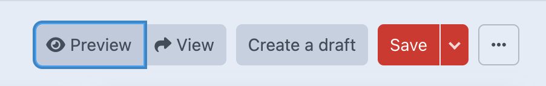

1. Click **Preview** to see how your page will look
2. Open the preview in a new tab
3. Check that everything looks correct

## Step 7: Understanding Global vs Local Content

Some content blocks offer **Global** vs **Local** options:

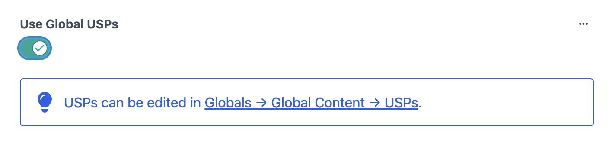

- **Global**: Uses site-wide content (managed in Global Settings)
- **Local**: Creates page-specific content

For example:
- **Global FAQ**: Shows the same questions on every page
- **Local FAQ**: Creates unique questions for this page only

## Common First-Time Tasks

### Update Page Text
1. Find the Text block with content to change
2. Click in the text area
3. Edit the content
4. Save your changes

### Add a New Section
1. Click **+ Add Content Block**
2. Choose **Text & Image**
3. Add your content and upload an image
4. Use color controls to match your design

### Change the Page Title
1. Look for the title field at the top of the page
2. Edit the title text
3. This affects both the page heading and navigation

## Next Steps

Now that you've made your first edit:

1. **Explore other content blocks** - Try different block types
2. **Learn about the Hero section** - Edit your page header
3. **Understand Global Settings** - Manage site-wide content
4. **Practice with SEO** - Optimize your pages for search engines

### Continue Learning:
- [Content Blocks](/content-blocks/) - Detailed guide to all block types
- [Page Management](/page-management/) - Creating and organizing pages
- [Global Settings](/global-settings/) - Site-wide content management

## Tips for Success

### Save Often
Use **Ctrl/Cmd + S** to save your work frequently.

### Use Preview
Always preview your changes before publishing.

### Start Small
Make small changes first to get comfortable with the interface.

### Ask for Help
Check the [Help & Support](/help/faq) section if you get stuck.

---

*Congratulations! You've made your first edit in Craft CMS. The more you practice, the more comfortable you'll become with the flexible content block system.*