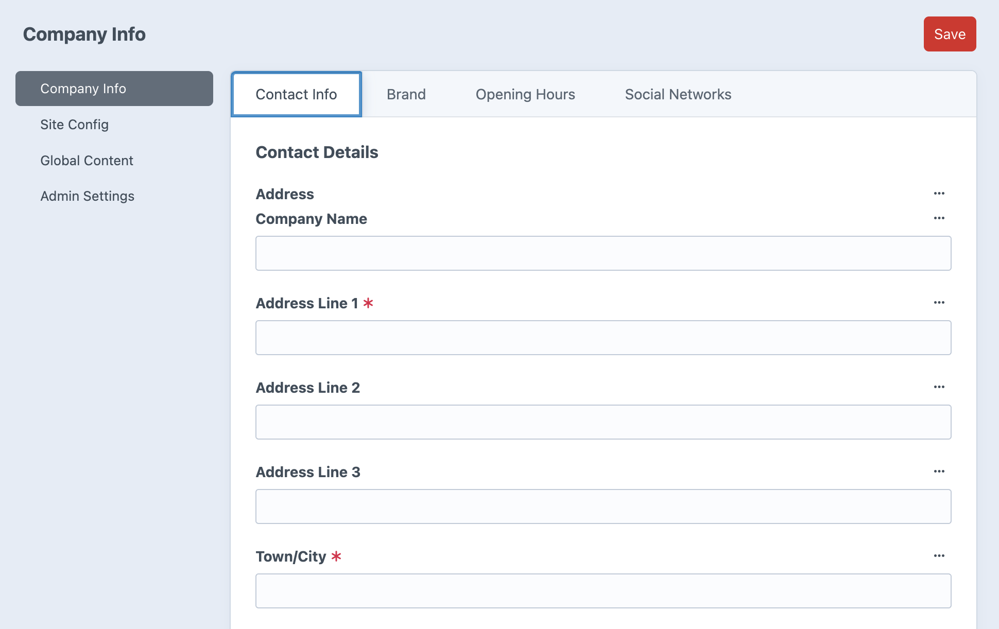
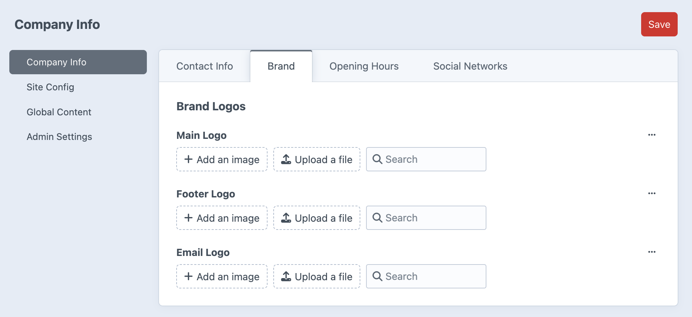
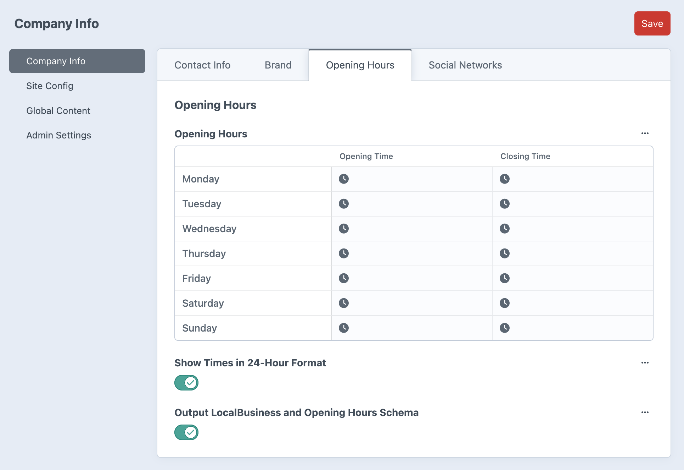
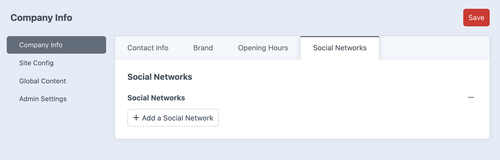

# Company Info

*Company contact information, brand assets, opening hours, and social networks*

The Company Info global set manages essential business information that appears throughout your site. This includes contact details, brand logos, opening hours, and social media links.

## Contact Info Tab

### Contact Details
- **Address** – Business address for contact information and maps
- **Email** – Primary business email address
- **Telephone** – Main business phone number
- **Fax** – Fax number (if applicable)

### Location Map
- **Location Map Embed Code** – HTML embed code for maps (Google Maps, etc.)
- Used by Contact Location blocks throughout the site
- Displays interactive maps with business location

### Legal Information
- **Limited Company Number** – Company registration number
- **Registered Address** – Official registered business address

## Brand Tab

### Brand Logos
- **Main Logo** – Primary logo used in site header and main branding
- **Footer Logo** – Logo variation used in site footer
- **Email Logo** – Logo used in email templates and communications

All logo fields accept brand assets and maintain consistent branding across different contexts.

## Opening Hours Tab

### Opening Hours Management
- **Opening Hours** – Business operating hours by day
- **Show Times in 24-Hour Format** – Toggle for time display format
- **Output LocalBusiness and Opening Hours Schema** – SEO schema markup generation

The opening hours can be displayed on contact pages and used for structured data to help search engines understand your business hours.

## Social Networks Tab

### Social Media Links
- **Social Networks** – Links to business social media profiles
- Used for social media icons and links throughout the site
- Maintains consistent social media presence across pages

---

*Company Info provides centralized management of essential business information used throughout your site for contact details, branding, and business hours.*
