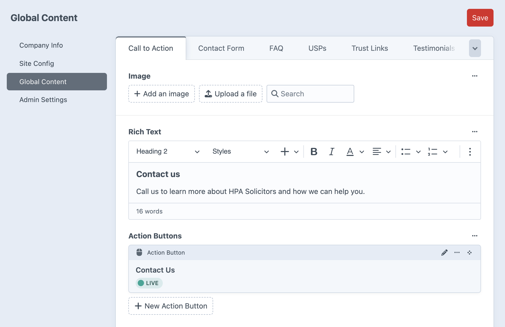
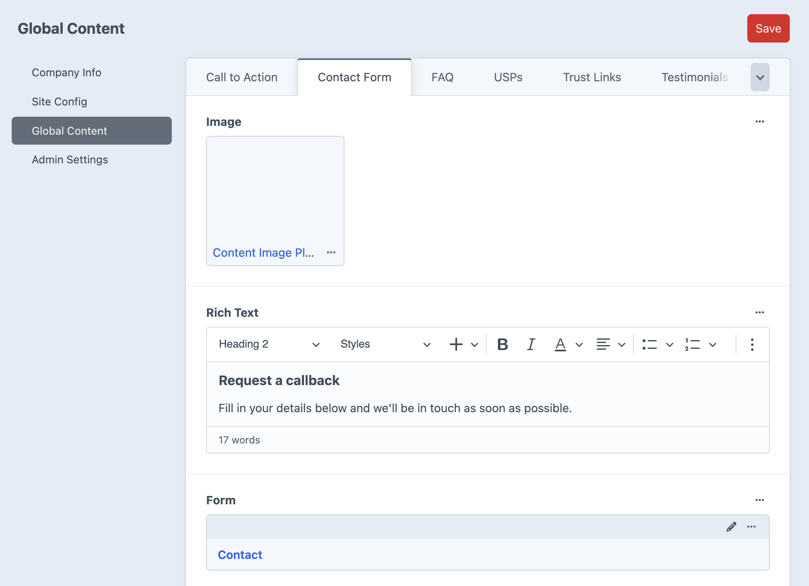
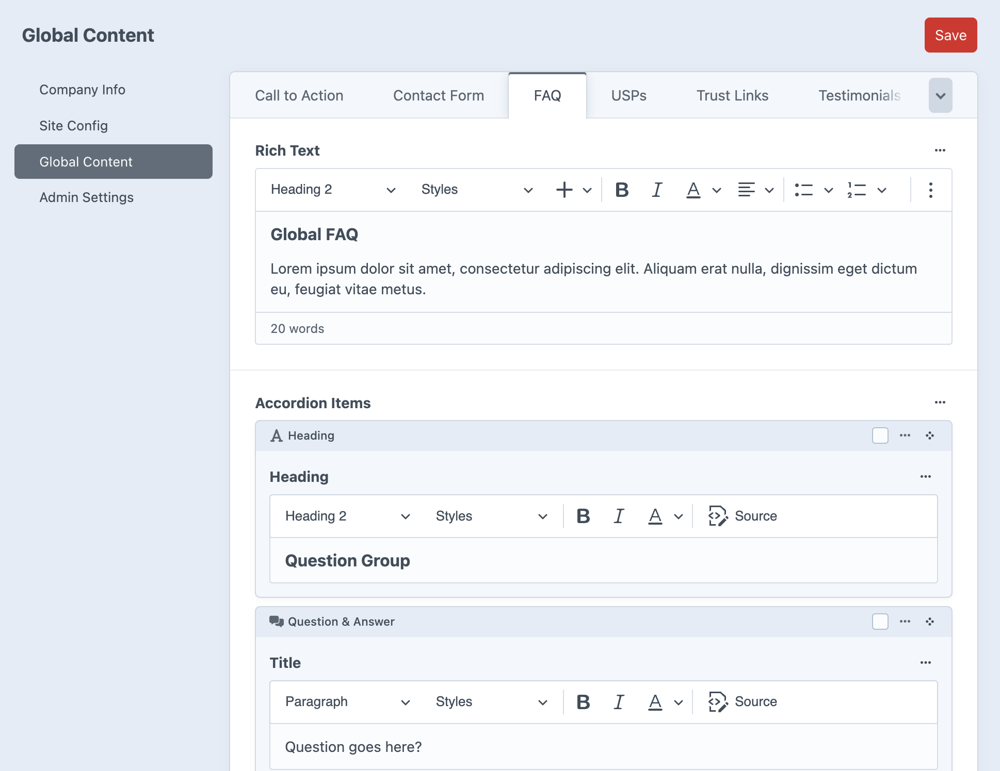
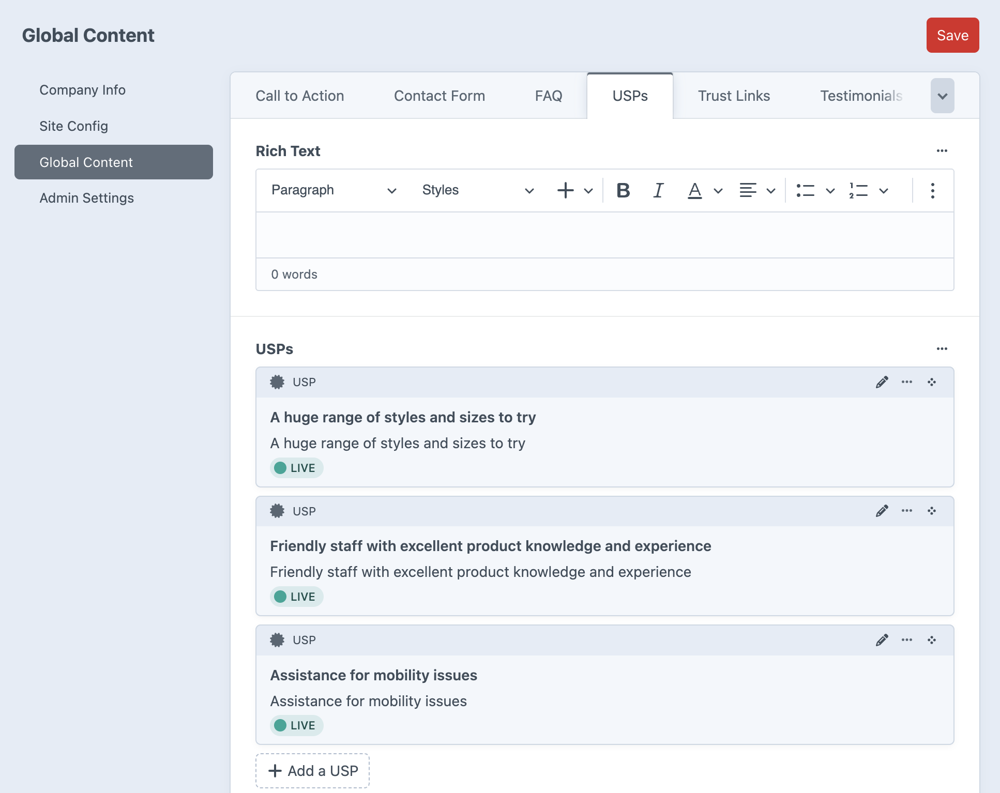
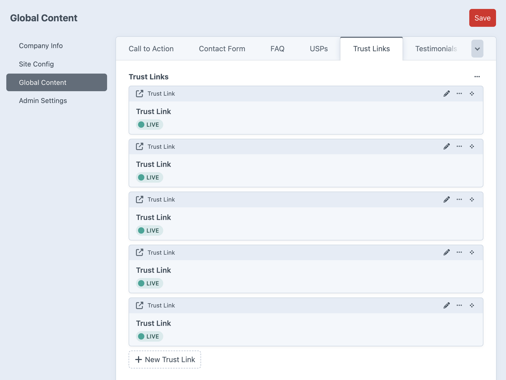
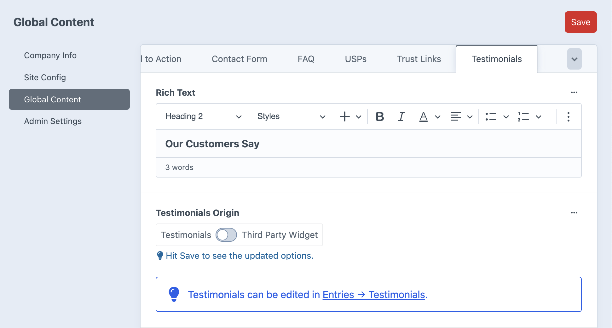
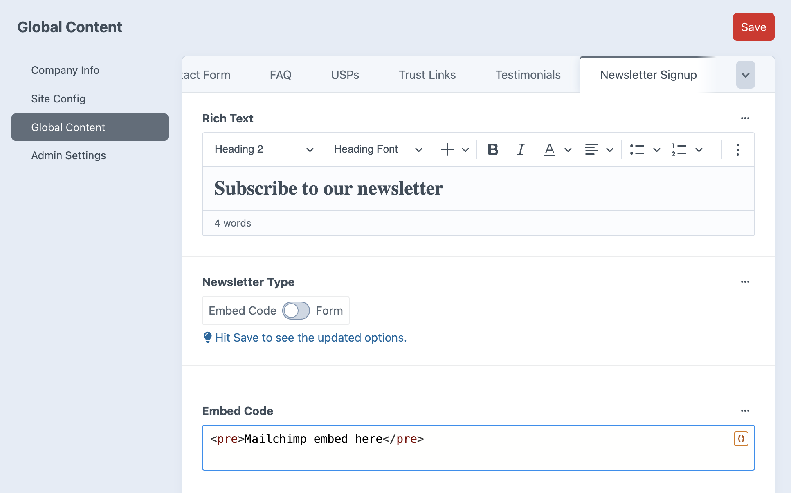

# Global Content

*Manage reusable content blocks and site-wide elements*

The Global Content section provides centralized management for content that can be used across multiple pages through content blocks. When content blocks have global options enabled, they pull content from these sections.

## Content Tabs

### Call to Action

Global call-to-action content used by CTA blocks site-wide:
- **Global CTA Image** – Background or card image for CTAs
- **Global CTA Rich Text** – Headline and descriptive text content
- **Global CTA Action Buttons** – Button text, links, and styling
- **Color Controls** – Heading, text, and background colors

### Contact Form

Global contact form configuration used by Contact Form blocks:
- **Global Contact Form Image** – Optional image for contact sections
- **Global Contact Form Rich Text** – Introductory text above forms
- **Global Contact Form** – Form selection and configuration
- **Color Controls** – Form styling and background options

### FAQ

Global frequently asked questions used by FAQ blocks:
- **Global FAQ Rich Text** – Introductory content above FAQ sections
- **Global FAQ Accordion Items** – Question and answer pairs
- **Global FAQ Behavior Options** – Open first item, all items stay open settings
- **Global FAQ Action Button** – Optional CTA after FAQ section
- **Color Controls** – FAQ styling and appearance options

### USPs

Global unique selling points used by USP blocks:
- **Global USPs Rich Text** – Introductory content above USPs
- **Global USPs Items** – Individual USP entries with icons and text
- **Color Controls** – USP section styling options

### Trust Links

Trust badges and certification links:
- Links to certifications, awards, and trust indicators
- Partner logos and affiliations
- Security badges and seals
- Used for building credibility across the site

### Testimonials

Global testimonials used by Testimonials blocks:
- **Global Testimonials Rich Text** – Introductory content above testimonials
- **Testimonials Origin Toggle** – Choose between custom testimonials or third-party reviews
- **Global Reviews Embed Code** – Third-party review widget code (e.g., Elfsight)
- **Color Controls** – Testimonial section styling
- Individual testimonials are managed in the Testimonials section entries

### Newsletter Signup

Email subscription form configuration:
- Newsletter signup form settings
- Email marketing platform integration
- Subscription confirmation settings
- Used for newsletter blocks and footer signups

## Using Global Content

### Global vs Local Content
Content blocks offer the choice between:
- **Global Content** – Centrally managed, consistent across all pages where used
- **Local Content** – Page-specific content that overrides global settings

### When to Use Global Content
- Standard company messaging that applies site-wide
- Consistent calls-to-action across multiple pages
- FAQ sections that don't vary by page
- Company USPs that apply universally
- Contact forms with standard fields and messaging

### Content Block Integration
Global content automatically appears in content blocks when:
- The "Use Global [Content Type]" toggle is enabled in the block
- Content editors don't need to recreate the same content repeatedly
- Updates to global content immediately reflect across all pages using it

---

*Global Content provides efficient content management through centralized control of reusable elements, ensuring consistency while allowing local customization when needed.*