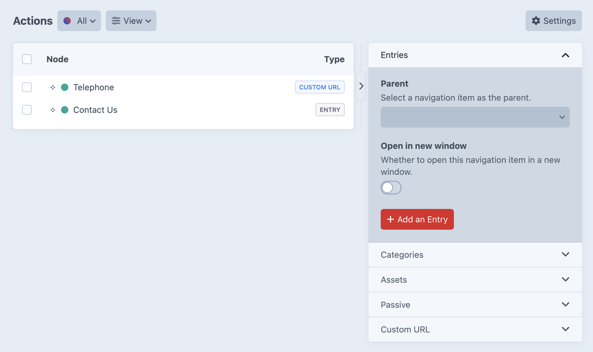
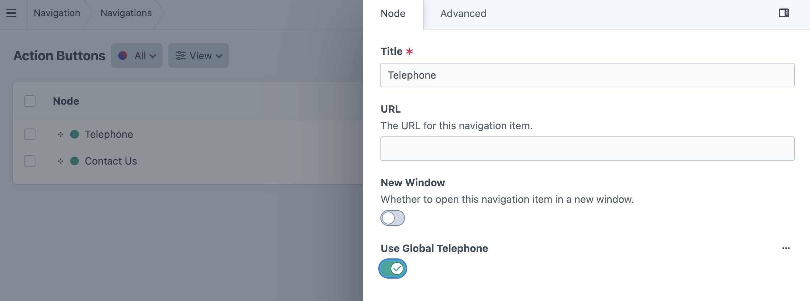

# Action Buttons

*Managing header call-to-action buttons like telephone and contact links*

## Action Buttons Purpose

Action Buttons create prominent call-to-action elements that appear in the site header, providing direct access to key contact methods and conversion opportunities.

<small>Action Buttons navigation interface showing Telephone (CUSTOM URL type) and Contact Us (ENTRY type) buttons in the navigation list</small>

## Action Button Types

### Entry-Based Action Buttons
**Contact Us** - Links to contact pages or forms within the site:
- Shows "ENTRY" type indicator
- Links to existing content pages like contact forms or information pages
- Maintains consistent internal site navigation experience

### Custom URL Action Buttons  
**Telephone** - Direct phone contact links using custom URLs:
- Shows "CUSTOM URL" type indicator in blue
- Uses `tel:` protocol for direct phone dialing functionality
- Enables one-click calling on mobile devices
- Can include formatted phone numbers for display

### Global Telephone Integration
**Use Global Telephone** - Automatic telephone number management:

<small>Use Global Telephone toggle switch in enabled state</small>

- **Toggle enabled** - Automatically pulls telephone number from Globals → Company Info
- **Centralized management** - Update phone number once in Company Info, applies everywhere
- **Consistency guarantee** - Ensures same phone number appears across all action buttons
- **Maintenance reduction** - Eliminates need to update phone numbers in multiple locations

### Header Integration
- **Prominent Placement** - Action buttons appear in the site header for maximum visibility
- **Conversion Focus** - Designed to encourage immediate contact and engagement
- **Mobile Optimization** - Telephone links particularly effective on mobile devices
- **Consistent Access** - Available on every page for reliable user access

## Creating Action Buttons

### Setting Up Contact Buttons
1. **Telephone Links** - Two configuration options available:
   
   **Global Telephone (Recommended)** - Enable "Use Global Telephone" toggle:
   - Automatically uses phone number from Globals → Company Info
   - Ensures consistency across all site telephone references
   - Simplifies maintenance when phone numbers change
   
   **Custom URL Manual** - Add custom URL nodes with `tel:` protocol:
   - Use format: `tel:+1234567890` for direct dialing
   - Display text can show formatted number: "(123) 456-7890"
   - Required when using phone numbers different from company main number

2. **Contact Page Links** - Add entry nodes linking to contact forms:
   - Link to existing contact pages or forms
   - Maintain internal site navigation consistency
   - Provide comprehensive contact information access

### Configuration Options
- **Node ordering** - Drag and drop to organize button priority
- **Display text** - Customize button labels for clear messaging
- **Link behavior** - Configure new window settings as appropriate
- **Mobile responsiveness** - Ensure buttons work effectively across devices

## Action Button Strategy

### Essential Contact Methods
**Primary Contact** - Most important contact method (usually phone or main contact form)
**Secondary Contact** - Alternative contact options for different user preferences
**Emergency Contact** - For service businesses requiring urgent contact capabilities

### Best Practices
- **Limit quantity** - Focus on 1-2 primary action buttons to avoid decision paralysis
- **Clear labeling** - Use direct, action-oriented text like "Call Now" or "Contact Us"
- **Mobile priority** - Ensure telephone links work seamlessly on mobile devices
- **Visual prominence** - Maintain design consistency while ensuring buttons stand out

### Performance Considerations
- **Conversion tracking** - Monitor which action buttons generate most engagement
- **User behavior** - Analyze whether users prefer phone contact or form submissions  
- **Mobile usage** - Track mobile vs desktop usage patterns for contact methods
- **Response optimization** - Ensure backend systems handle action button traffic effectively

Action Buttons provide direct pathways for users to engage with your business, focusing on immediate contact and conversion opportunities through strategic header placement.

---

*Action Buttons create essential conversion pathways by providing prominent, accessible contact methods in the site header.*