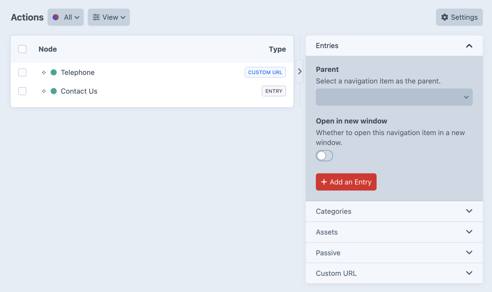
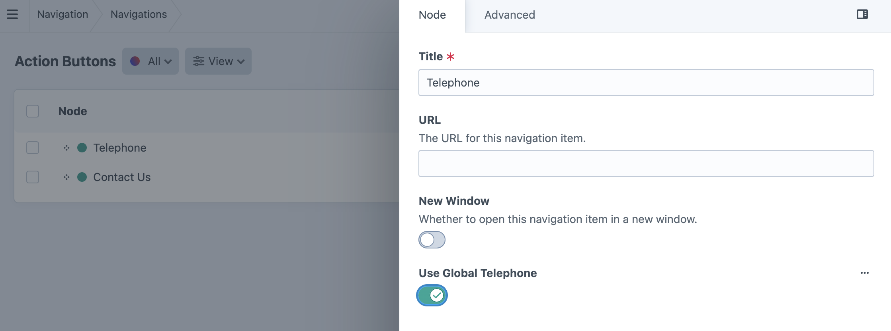

# Actions

*Managing header call-to-action buttons like telephone and contact links*

## Actions Purpose

Actions create prominent call-to-action elements that appear in the site header, providing direct access to key contact methods and conversion opportunities.

<small>Actions navigation interface showing Telephone (CUSTOM URL type) and Contact Us (ENTRY type) buttons in the navigation list</small>

## Action Types

### Entry-Based Action Buttons
**Contact Us** - Links to contact pages or forms within the site:
- Shows "ENTRY" type indicator
- Links to existing content pages like contact forms or information pages
- Maintains consistent internal site navigation experience

### Custom URL Action Buttons  
**Telephone** - Direct phone contact links using custom URLs:
- Shows "CUSTOM URL" type indicator in blue
- Uses `tel:` protocol for direct phone dialing functionality
- Enables one-click calling on mobile devices
- Can include formatted phone numbers for display

### Global Telephone Integration
**Use Global Telephone** - Automatic telephone number management:

<small>Use Global Telephone toggle switch in enabled state</small>

- **Toggle enabled** - Automatically pulls telephone number from Globals → Company Info
- **Centralized management** - Update phone number once in Company Info, applies everywhere
- **Consistency guarantee** - Ensures same phone number appears across all action buttons
- **Maintenance reduction** - Eliminates need to update phone numbers in multiple locations

### Header Integration
- **Prominent Placement** - Action buttons appear in the site header for maximum visibility
- **Conversion Focus** - Designed to encourage immediate contact and engagement
- **Mobile Optimization** - Telephone links particularly effective on mobile devices
- **Consistent Access** - Available on every page for reliable user access

## Creating Actions

### Setting Up Contact Buttons
1. **Telephone Links** - Two configuration options available:
   
   **Global Telephone (Recommended)** - Enable "Use Global Telephone" toggle:
   - Automatically uses phone number from Globals → Company Info
   - Ensures consistency across all site telephone references
   - Simplifies maintenance when phone numbers change
   
   **Custom URL Manual** - Add custom URL nodes with `tel:` protocol:
   - Use format: `tel:+1234567890` for direct dialing
   - Display text can show formatted number: "(123) 456-7890"
   - Required when using phone numbers different from company main number

2. **Contact Page Links** - Add entry nodes linking to contact forms:
   - Link to existing contact pages or forms
   - Maintain internal site navigation consistency
   - Provide comprehensive contact information access

### Configuration Options
- **Node ordering** - Drag and drop to organize button priority
- **Display text** - Customize button labels for clear messaging
- **Link behavior** - Configure new window settings as appropriate
- **Mobile responsiveness** - Ensure buttons work effectively across devices

## Action Button Strategy

### Essential Contact Methods
**Primary Contact** - Most important contact method (usually phone or main contact form)
**Secondary Contact** - Alternative contact options for different user preferences
**Emergency Contact** - For service businesses requiring urgent contact capabilities

### Best Practices
- **Limit quantity** - Focus on 1-2 primary action buttons to avoid decision paralysis
- **Clear labeling** - Use direct, action-oriented text like "Call Now" or "Contact Us"
- **Mobile priority** - Ensure telephone links work seamlessly on mobile devices
- **Visual prominence** - Maintain design consistency while ensuring buttons stand out

### Performance Considerations
- **Conversion tracking** - Monitor which action buttons generate most engagement
- **User behavior** - Analyze whether users prefer phone contact or form submissions  
- **Mobile usage** - Track mobile vs desktop usage patterns for contact methods
- **Response optimization** - Ensure backend systems handle action button traffic effectively

Actions provide direct pathways for users to engage with your business, focusing on immediate contact and conversion opportunities through strategic header placement.

---

*Actions create essential conversion pathways by providing prominent, accessible contact methods in the site header.*