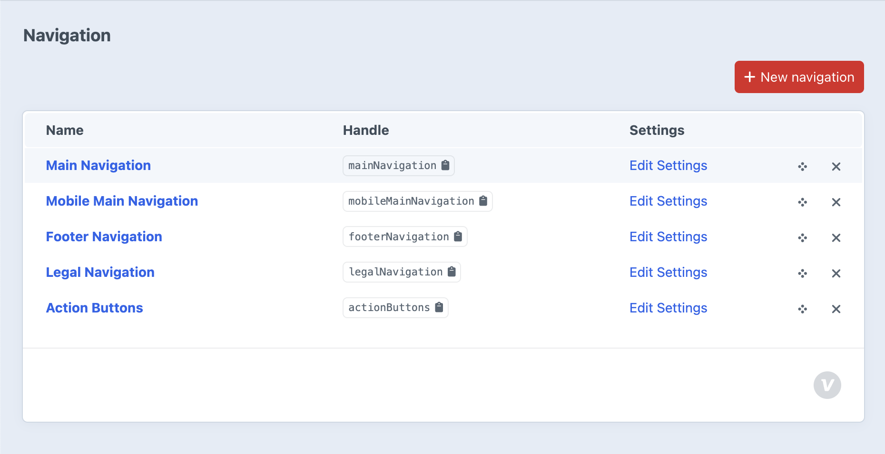

# Navigation

*Managing site navigation menus and structure*

Craft CMS organizes navigation through five distinct navigation types, each serving specific purposes across the website. Rather than a single menu system, this approach allows targeted control over different navigation areas while maintaining consistent management interfaces.

## What You'll Learn

- The five navigation types and their specific purposes across the site
- How Entry and Passive nodes create hierarchical menu structures  
- Navigation management workflow from editing to publishing changes
- Integration between navigation structure and actual page content

## In This Section

- **[Main Navigation](main-navigation.md)**: Primary desktop navigation with hierarchy and dropdown support
- **[Footer Navigation](footer-navigation.md)**: Site-wide footer links and secondary navigation
- **[Legal Navigation](legal-navigation.md)**: Compliance and legal page links
- **[Actions](actions.md)**: Prominent call-to-action navigation elements

## Navigation Structure Concepts

### Navigation Types Overview
Each navigation serves distinct site areas:

**Main Navigation** - Primary desktop menu with hierarchical organization and dropdown functionality for comprehensive site navigation.

**Mobile Main Navigation** - Mobile-optimized menu structure designed for touch interaction and smaller screen navigation patterns.

**Footer Navigation** - Secondary navigation for footer areas, typically featuring utility pages and additional site sections.

**Legal Navigation** - Dedicated menu for compliance pages like privacy policies, terms of service, and regulatory requirements.

**Actions** - Strategic call-to-action elements that appear in the header.

### Node Types and Hierarchy
Navigation items can be **Entry nodes** that link to specific pages or **Passive nodes** that group items without direct links. This creates flexible menu structures with dropdown organization.

### Management Workflow
Navigation changes are made through drag-and-drop reordering, with visual hierarchy display showing parent-child relationships. Changes are published to update live site navigation.

Each navigation type maintains its own structure while sharing consistent management interfaces, ensuring organized site navigation without complexity.

---

*Navigation management allows content editors to maintain site structure without technical knowledge, ensuring user-friendly site organization.*
