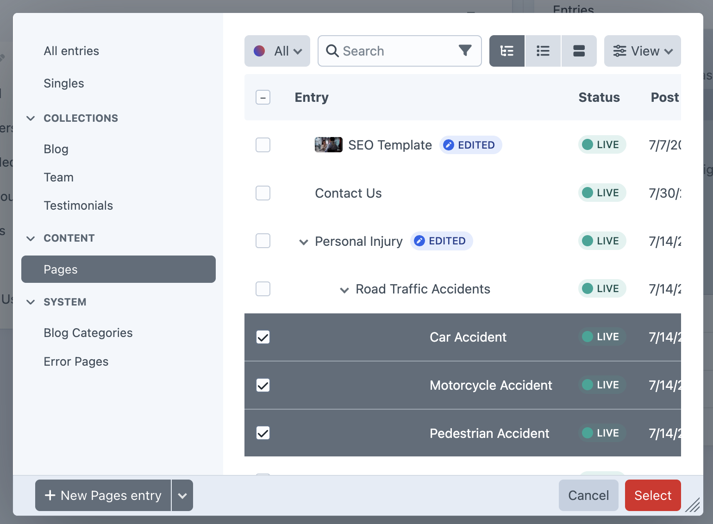

# Main Navigation

*Managing the primary site navigation menu*

## Main Navigation Interface

The Main Navigation manages the primary menu structure that appears in the site header and powers the desktop navigation experience.

<small>Main Navigation editing interface showing hierarchical menu structure with entries, along with sidebar for adding new entries</small>

### Navigation Structure Display

**Hierarchical Menu View** - Shows the complete navigation structure with visual hierarchy:
- **Node Column** - Lists navigation items with hierarchical indentation
- **Type Column** - Indicates whether items are "ENTRY" or "PASSIVE" types
- **Visual Hierarchy** - Parent-child relationships shown through indentation and expand/collapse controls

### Navigation Entry Types

**Entry Nodes** - Direct links to specific pages:
- Display with "ENTRY" type indicator  
- Link directly to created content pages
- Appear as clickable navigation items

**Passive Nodes** - Grouping elements without direct links:
- Display with "PASSIVE" type indicator in orange
- Serve as parent containers for sub-navigation
- Create dropdown/megamenu sections without being clickable themselves

### Drag and Drop Organization

Navigation items can be reordered through drag-and-drop functionality:
- **Reorder items** at the same hierarchy level
- **Change parent relationships** by dragging items under different parents
- **Create sub-navigation** by nesting items under parent entries
- **Visual feedback** during dragging shows valid drop zones

## Adding Navigation Items

### Entry Addition Panel

**Entries Section** - Add content pages to navigation:
- **Parent Dropdown** - "Select a navigation item as the parent" for hierarchical placement
- **Open in new window Toggle** - Control whether links open in new tabs
- **Add an Entry Button** - Access entry selection modal for adding pages

### Additional Node Types

**Categories** - Add category-based navigation elements
**Assets** - Include asset-based navigation items  
**Passive** - Create non-linking grouping elements
**Custom URL** - Add external links or custom destinations

## Entry Configuration Panel

When adding or editing navigation entries, a detailed configuration panel provides advanced options for controlling how entries behave within the navigation structure.

[Screenshot: Entry configuration panel showing Node and Advanced tabs, with Title field containing "Personal Injury", Linked to Entry showing Personal Injury page connection, New Window toggle, and Include All Children toggle enabled]

### Entry Configuration Options

**Title Field** - The display name for the navigation item, which can differ from the linked page title.

**Linked to Entry** - Shows the connected content page:
- Displays the linked page with entry indicator
- "The element this node is linked to" - confirms page connection
- Allows relinking to different pages if needed

**New Window Control** - Toggle switch determining link behavior:
- **Disabled** - Links open in same window (standard behavior)
- **Enabled** - Links open in new window/tab

### Automatic Navigation Building

**Include All Children** - Powerful automation feature for building comprehensive navigation:
- **Toggle enabled** - Automatically includes all child and grandchild pages in navigation
- **Dynamic updates** - Navigation structure updates automatically when new child pages are created
- **Hierarchical building** - Maintains page hierarchy relationships in navigation structure
- **Maintenance reduction** - Eliminates need to manually add each new child page to navigation

#### Include All Children Benefits

**Automatic Organization** - New pages automatically appear in appropriate navigation sections
**Consistent Structure** - Maintains navigation hierarchy that matches content organization  
**Time Saving** - Reduces manual navigation maintenance when adding new content
**User Experience** - Ensures users can always access all available content through navigation

This feature is particularly valuable for sections like services, where new service pages should automatically appear under their parent service category without requiring manual navigation updates.

## Creating Passive Navigation Elements

[Screenshot: Passive section showing Parent dropdown, Title field with "Name of this node in the navigation" description, and "Add Passive" button]

**Passive Node Creation** allows grouping navigation items without direct page links:

**Parent Selection** - Choose where the passive element appears in hierarchy
**Title Field** - "Name of this node in the navigation" - sets the display text
**Add Passive Button** - Creates the passive grouping element

### Use Cases for Passive Elements

- **Service Category Headers** - Group related service pages under "Personal" category
- **Dropdown Section Titles** - Create megamenu sections without clickable headers  
- **Navigation Organization** - Separate content areas without requiring dedicated pages

## Navigation Management Workflow

### Organizing Menu Structure
1. **Plan hierarchy** - Determine main sections and sub-categories
2. **Create passive parents** - Add grouping elements for major sections
3. **Add entry children** - Place content pages under appropriate parents
4. **Reorder items** - Drag and drop for optimal user flow
5. **Test navigation** - Preview functionality and user experience

### Best Practices

**Logical Grouping** - Group related pages under meaningful parent categories
**Clear Hierarchy** - Maintain consistent levels and avoid excessive nesting
**User-Focused Organization** - Structure navigation around user needs and common tasks
**Performance Consideration** - Balance comprehensive navigation with usability

The Main Navigation system provides flexible menu management while maintaining clean separation between content creation and navigation structure, allowing content editors to focus on user experience without technical complexity.

---

*Main Navigation management enables intuitive site navigation that guides users efficiently to their desired content.*