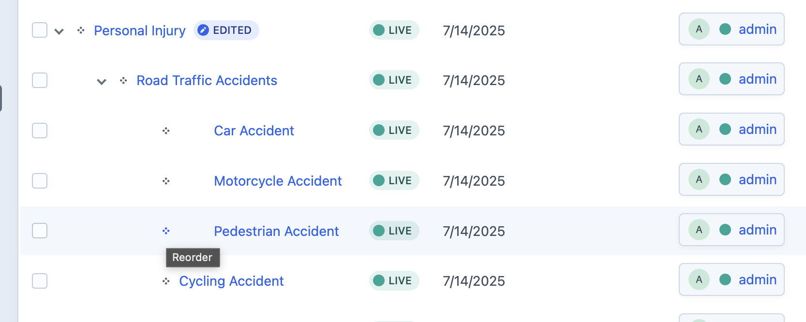

# Organizing Pages

Craft CMS allows you to organize your pages into a **hierarchy**, creating parent-child relationships that define your site's structure. This is a powerful feature for keeping your content organized and creating user-friendly URLs.

## The Parent-Child System

When you create or edit a page, you can assign it a **Parent** page. This simple action has two major effects:

1.  **URL Structure**: The child page's URL will be nested under the parent's URL.
2.  **Navigation**: In many cases, the site navigation will automatically reflect this hierarchy, placing the child page in a dropdown menu under its parent.

### How to Set a Parent Page

1.  While editing any entry, find the **Parent** field in the right-hand sidebar.
2.  Click **Choose** to open a list of all available pages.
3.  Select the page you want to be the parent.

### Example of Page Hierarchy

Imagine you have a main "Services" page. You can create individual pages for each service you offer (e.g., "Web Design," "Content Marketing") and set their parent to "Services."

This would result in the following clean, logical URL structure:

-   `/services`
-   `/services/web-design`
-   `/services/content-marketing`

## Managing Hierarchy in the Entries List

You can see and manage the entire page hierarchy directly from the main entries list.

-   **Visual Tree Structure**: The list is displayed as an expandable tree, making it easy to see the parent-child relationships.
-   **Reordering**: You can drag and drop pages to change their order within the same level.
-   **Changing Parents**: You can also drag a page to be nested under a *different* parent, instantly changing its URL and position in the site structure.

---

*Using a clear parent-child hierarchy is the key to a well-organized website that is easy for both users and search engines to navigate.*