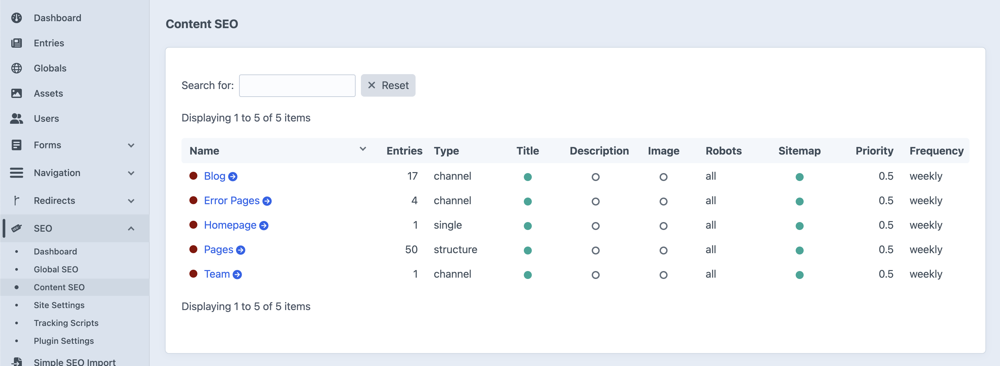

# Content SEO Settings

**Content SEO** is the second layer of your site's SEO strategy, allowing for more specific rules to be applied to different *types* of content. While **Global SEO** sets the rules for the entire site, Content SEO lets you create tailored templates for each section, such as Blog posts, Team profiles, or Pages.

You can find these settings under **SEO → Content SEO** in the main sidebar.

## Why Use Content SEO?

Different types of content have different SEO needs. For example, the best way to optimize a blog post is different from the best way to optimize a team member's profile. Content SEO allows you to define unique templates for each.

For instance, you could set up a rule for all **Blog** posts to automatically format their SEO titles like this:
`{entry.title} | My Awesome Blog`

And for all **Team** profiles, you could set up a different rule:
`{entry.title}, {entry.jobTitle} | Our Team`

As a content editor, you won't typically need to edit these templates yourself, as they are set up by a developer. However, it's useful to understand that these rules exist, as they are the reason why different content types might have slightly different SEO outputs automatically.

## The SEO Hierarchy

Content SEO settings override the site-wide **Global SEO** defaults, but they can be overridden by the settings on an individual piece of content (**Entry SEO**).

1.  **Global SEO**: The default rules for the whole site.
2.  **Content SEO** (Medium Priority): Rules for specific content types (e.g., all Blog posts). These override Global settings.
3.  **Entry SEO**: Custom rules for an individual page or entry. These override everything else.

This system gives you a powerful combination of automation and fine-tuned control.

---

*For advanced users, the official SEOmatic documentation offers deep technical details on creating and managing these templates, but be aware that it is written for developers. You can find it [here](https://nystudio107.com/docs/seomatic/v4/configuring/content-seo.html).*