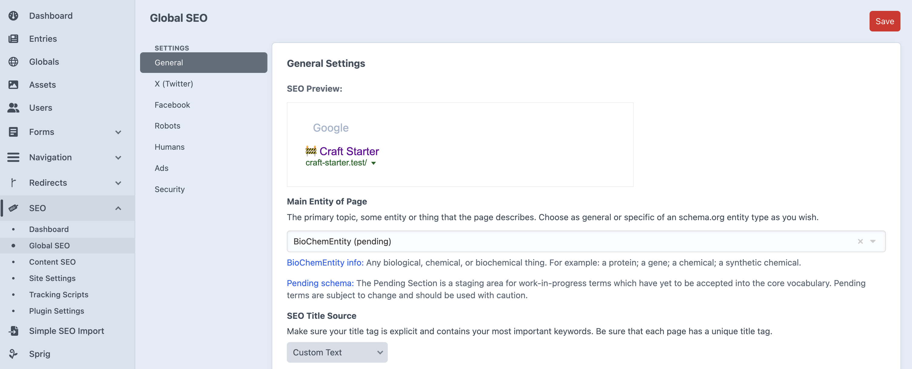

# Global SEO Settings

The **Global SEO** section, powered by the SEOmatic plugin, sets the baseline for your entire website's search engine optimization. Think of these settings as the "default rules" that apply automatically to every page, ensuring your site maintains consistent, high-quality SEO without needing manual input on every single entry.

You can find these settings under **SEO → Global SEO** in the main sidebar.

## General Settings Explained

While this area has many technical options, as a content editor, you only need to understand a few key concepts that form your site's SEO foundation. These settings are typically configured once by a developer and rarely changed.

-   **SEO Title Source**: This determines how the title of a page (the text that appears in the browser tab and as the main headline in Google search results) is automatically generated. It usually combines the entry's own title with the site name.
-   **Site Name Position**: This controls where your website's name (e.g., "Craft Starter") appears in the SEO title—either before or after the page's specific title.
-   **SEO Description Source**: This sets a default meta description if one isn't provided on an individual page. It might pull from a global description or a specific field to avoid empty descriptions.
-   **SEO Image Source**: This selects a default image to be used in social media shares if a page doesn't have its own specific image. This is crucial for ensuring your brand is represented well when links are shared.

These global rules are the first step in a three-layer SEO system:

1.  **Global SEO** (Lowest Priority): The default rules for the whole site.
2.  **Content SEO**: Rules for specific types of content (e.g., all Blog posts).
3.  **Entry SEO** (Highest Priority): Custom rules for an individual page or entry.

Settings at a more specific level will always override the global defaults.

---

*For advanced users, the official SEOmatic documentation offers deep technical details, but be aware that it is written for developers. You can find it [here](https://nystudio107.com/docs/seomatic/v4/configuring/global-seo.html).*