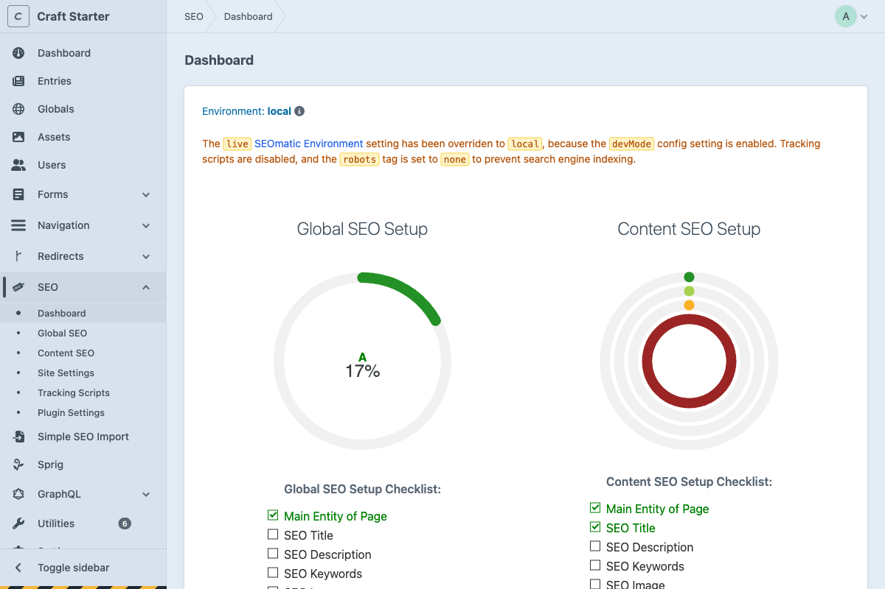

---
next:
  text: 'Global SEO'
  link: '/seo-marketing/global-seo'
---

# SEO & Marketing

*Managing search engine optimization and marketing tools in Craft CMS*

Craft CMS handles search engine optimization through the SEOmatic plugin, providing both global settings and individual page controls. Rather than requiring manual meta tag management, the system automates SEO optimization while allowing customization when needed.

## What You'll Learn

- How SEO settings are organized between global templates and page-specific controls
- The SEO tab interface for individual page optimization
- Schema markup generation for enhanced search results
- Integration between global SEO settings and content management

## In This Section

- **[Global SEO](global-seo.md)**: Site-wide SEO configuration and default templates
- **[Content SEO](content-seo.md)**: Section-specific SEO settings and automation
- **[Entry SEO](entry-seo.md)**: Page-level SEO controls and overrides
- **[Schema Markup](schema.md)**: Structured data configuration and generation

## SEO Management Approach

### Automated Optimization
The SEOmatic plugin automatically generates meta titles, descriptions, and structured data based on content, reducing manual SEO work while maintaining optimization standards.

### Global Templates
Site-wide SEO settings provide consistent defaults across all content types, with automatic generation of social media tags, meta descriptions, and technical SEO elements.

### Page-Level Control
Individual entries include an SEO tab for customization and overrides when specific pages require unique optimization approaches.

### Schema Integration  
Structured data markup is automatically generated based on content type and can be customized through schema settings for enhanced search engine understanding.

For comprehensive SEO configuration guidance, refer to the [SEOmatic documentation](https://nystudio107.com/docs/seomatic/).

---

*SEO management in Craft CMS provides comprehensive optimization tools while maintaining editorial simplicity.*